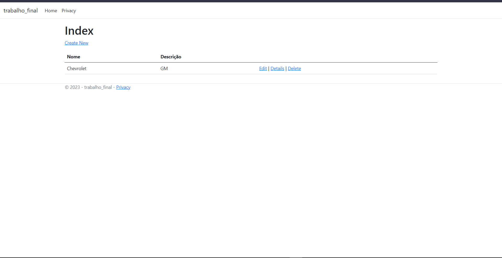
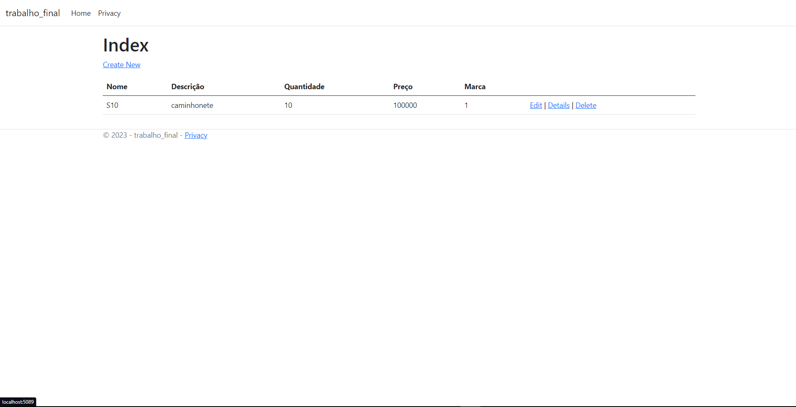
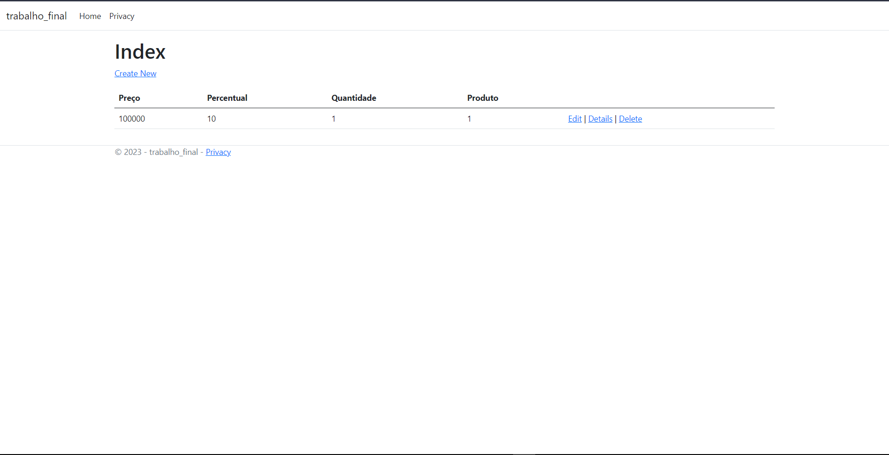
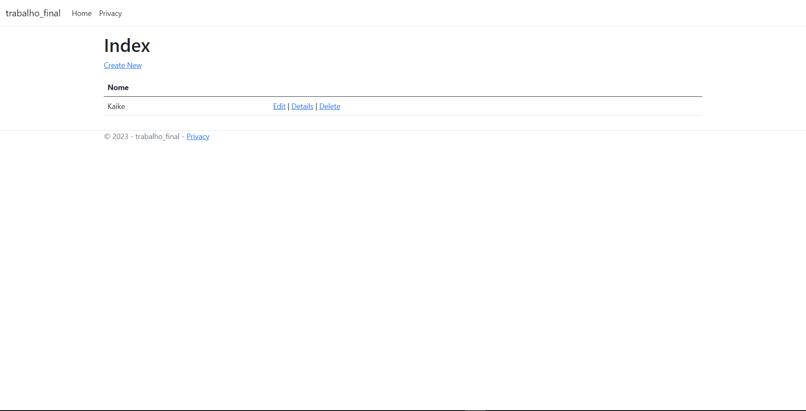
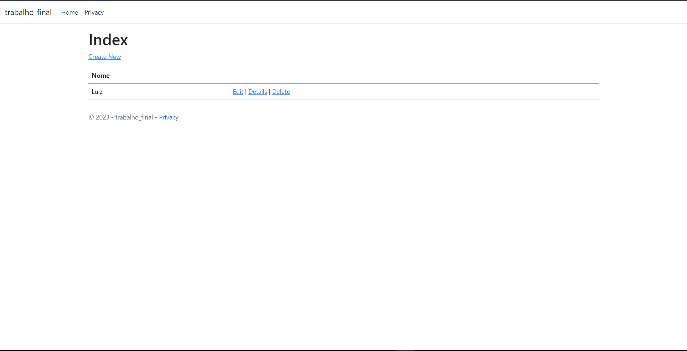
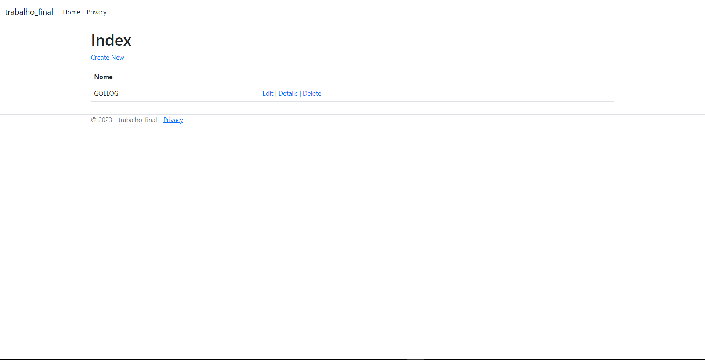
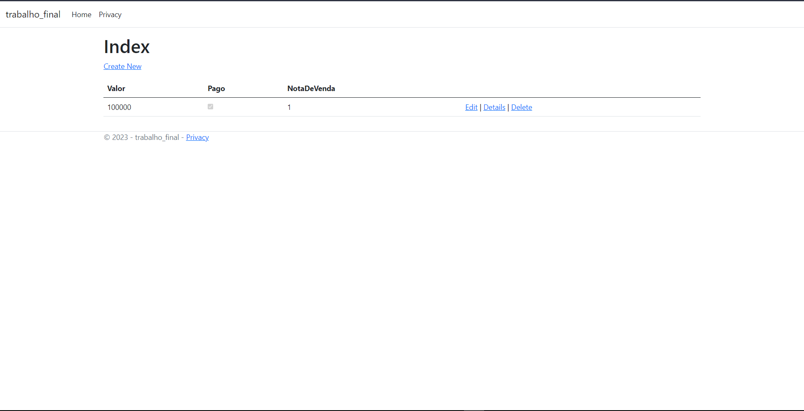

# Trabalho Final de Análise e Projeto de Sistemas

**Aluno:** Kaike Dias Miranda  
**Matrícula:** 2022111TADS0240

#### Telas:

     Marcas

     Produtos

     Itens

     Clientes:
     

     Vendedores

     Transportadoras

     Pagamentos com Cartão

     Pagamentos em Cheque

     Notas de Venda

     Pagamentos

